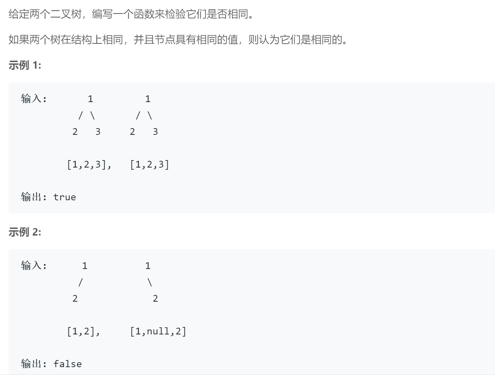

## 题目描述


<br />

## 我的解法
```
/**
 * Definition for a binary tree node.
 * struct TreeNode {
 *     int val;
 *     TreeNode *left;
 *     TreeNode *right;
 *     TreeNode(int x) : val(x), left(NULL), right(NULL) {}
 * };
 */

class Solution {
public:
    
    bool isSameTree(TreeNode* p, TreeNode* q) {
        if(!p && !q)
            return true;
        else if ((!p && q) || (p && !q))
            return false;
        else if ((p && q) && (p->val != q->val))
            return false;
        else
            return (isSameTree(p->left, q->left) && isSameTree(p->right, q->right));
    }
};
```
<br/>


## 要点
- 递归的思想
- 判断当前两个节点是否为空，如果都不为空，则判断他们值是否相同以及左右节点是否相同