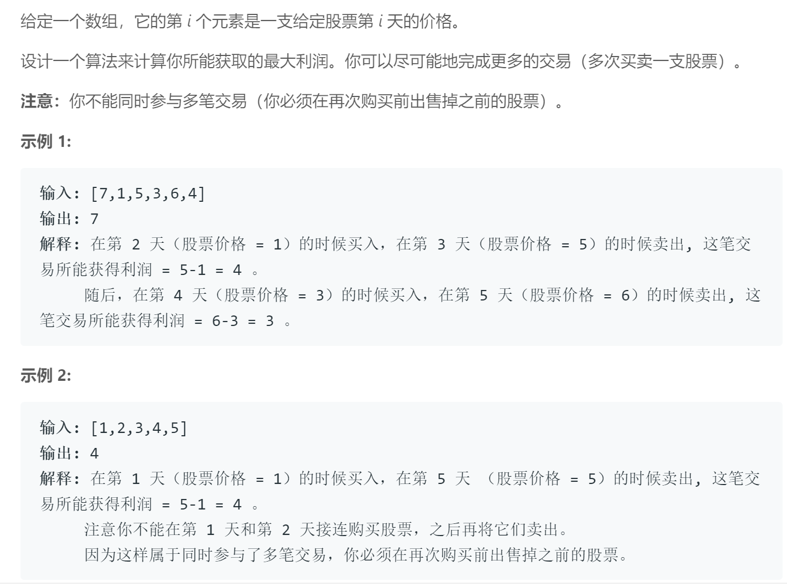
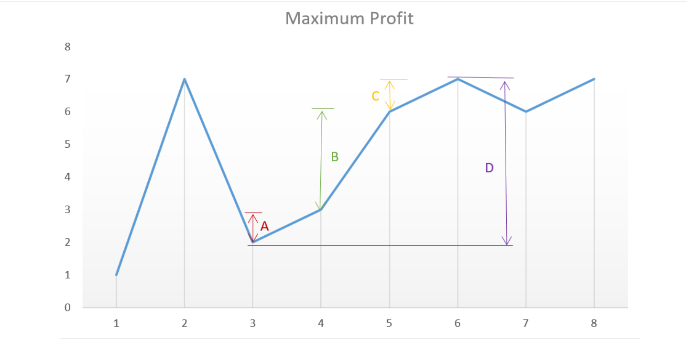

## 题目描述


<br />

## 我的解法
```
class Solution {
public:
    int maxProfit(vector<int>& prices) {
        int size = prices.size();
        int result = 0;
        if (size == 0)
            return result;
        for (int i=0; i<(size-1); i++)
            result += (prices[i+1] > prices[i]) ? (prices[i+1] - prices[i]):0;
        
        return result;
    }
};
```

<br />

## 要点

- 第一反应就是暴力法，解出所有买卖方案然后比较，但是想着想着就觉得太复杂不可行
- 仔细想一想，其实不论怎么价格怎么样，无非就两种情况，递增/递减

- 递增：如3-6这一段，最大值D其实就等于A+B+C，所以可以拆成三小段相加
- 递减：如果之后没有递增的部分，那么也就不存在买卖了；如果递减之后还递增，如1-4这一段，可以发现1买2卖3买4卖是赚得最多的，即只要有增加的部分，就可以加
- 唯一的疑惑就在于，如果是[1,5,3,10]这样的数组，到底是分两次买卖还是1买10卖赚得多。事实证明：一定是分两次赚更多。因为1-10其实等于1-5加上5-10这两段之和，而现在因为有3的存在说明买的时候会更低，多出一段3-5的利润，所以一定是两段赚更多
- 综合以上几种情况可以总结出，只要后面一个数大于前面一个数，就可以把这一段差加到总和上面