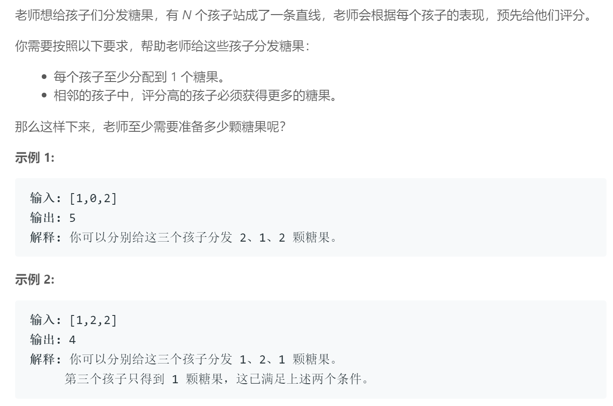

## 题目描述

<br/>

## 我的解法
```
class Solution {
public:
    int candy(vector<int>& ratings) {
        int res = 0, 
        int n = ratings.size();
        vector<int> nums(n, 1);  //全部赋值为1
        for (int i = 0; i < n - 1; ++i) {
            if (ratings[i + 1] > 
                ratings[i]) nums[i + 1] = nums[i] + 1;
        }
        for (int i = n - 1; i > 0; --i) {
            if (ratings[i - 1] > ratings[i]) 
                nums[i - 1] = max(nums[i - 1], nums[i] + 1);
        }
        for (int num : nums) 
            res += num;

        return res;
    }
};
```

<br />

## 要点
- 用一个新的vector来存每个小朋友拿到的糖果数，初始值均为一，表示每个小朋友至少都有一个糖
- 遍历数组，如果当前同学分比前面一个同学分高，则只需让当前同学的糖果数增加至前一个同学糖果数+1
- 如果当前同学的分数没有前面同学高,分两种情况，第一，若糖果数比前者少则ok，如果糖果数比前者多或者持平，则需要回溯，即增加前者的糖果数，依次类推，可能导致前者的前者，前者的前者的前者....都发生改变，而且如果继续往后遍历，可能之前回溯的部分需要重新再改变数量，所以因此选择正序和倒序各遍历一次ratings数组
- 正序只判断后者是否比前者分高，即只让后者增加糖果数
- 倒序只需判断前者是否比后者分高，即完成回溯部分，如果前者糖果数本来就比较多，则不需要更改，反之，前者糖果数应改为后者糖果数+1