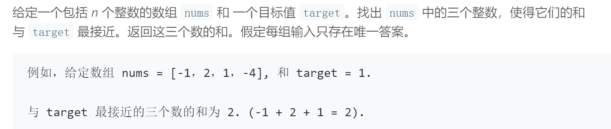

## 题目描述


## 我的解法
```
class Solution {
public:
    int threeSumClosest(vector<int>& nums, int target) {
        sort(nums.begin(), nums.end());
        int size = nums.size();
        int result = nums[0] + nums[1] + nums[2];
        int min = abs(target - result);
        for (int i=0; i<size-2; i++)
        {
            int j = i + 1;
            int k = size - 1;
            while(j<k)
            {
                int tmp = nums[i] + nums[j] + nums[k];
                if(tmp == target)
                    return target;
                result = (abs(tmp - target) < min) ? tmp : result;
                min = (abs(tmp - target) < min) ? abs(tmp-target) : min;
                if(tmp < target)
                    j++;
                else
                    k--;
            }
        }
        
        return result;
            
    }
};

```

## 要点
- 暴力法也可求解，但是时间复杂度为O(n^3)
- 首先将数组排序；总共需取出三个数，第一个数可以遍历数组，第二、三个数是在第一个数之后的数中取出的，此时用两个指针指着第二、三个数，如果三数之和小了则将j指针往后移，如果大了则将k指针往前移，直到j和k指针相遇