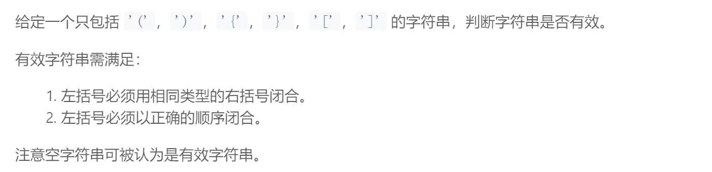
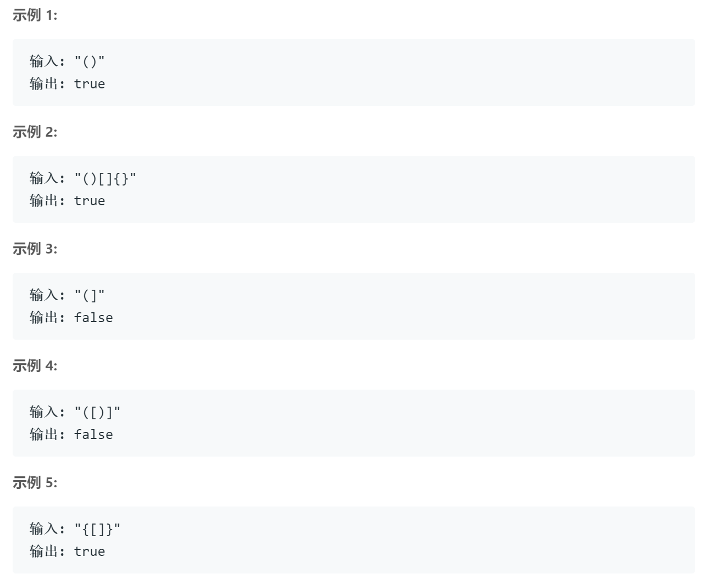

## 题目描述



<br />

## 我的解法
```
class Solution {
public:
    bool isValid(string s) {
        stack<char> front;
        int len = s.length();
        for(int i=0; i<len; i++)
        {
            if(s[i]=='(' || s[i]=='{' || s[i]=='[')
                front.push(s[i]);
            else
            {
                if(front.empty() )
                    return false;
                char tmp = front.top();
                front.pop();         
                if ((tmp=='(' && s[i]==')') || (tmp=='{'&& s[i]=='}') || (tmp=='[' && s[i]==']'))
                    continue;
                else
                    return false;
            }
        }
        if(!front.empty())
            return false;
        return true;
    }
};
```

<br />

## 要点
- 判断有效的主要标准是：最先出现的闭括号应该和最后出现的开括号对应，所以想到用stack来存遍历过的开括号
- 注意两种特殊情况：闭括号出现在开括号之前 & 开括号个数比闭括号多
对应的就是循环中判断stack是否为空和退出循环后判断stack是否为空
- 标答用map，但这里因为只有三种情况就懒得用map了