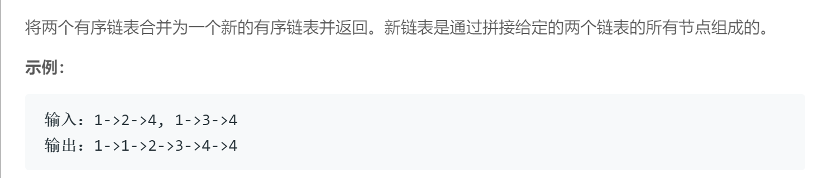

## 题目描述


## 我的代码
```
/**
 * Definition for singly-linked list.
 * struct ListNode {
 *     int val;
 *     ListNode *next;
 *     ListNode(int x) : val(x), next(NULL) {}
 * };
 */
class Solution {
public:
    ListNode* mergeTwoLists(ListNode* l1, ListNode* l2) {
        
        if(l1 == NULL || l2==NULL)
            return ((l1==NULL)? l2: l1);
        
        ListNode* head, *tmp1, *tmp2 = new ListNode(0);
        
        if(l1->val > l2->val)
        {
            head = l2;
            tmp1 = l1;
            tmp2 = l2->next;
        }
        else
        {
            head = l1;
            tmp1 = l1->next;
            tmp2 = l2;
        }
        
        ListNode* tmp = head;
        
        while(true)
        {
            if (tmp1 == NULL)
            {
                tmp->next = tmp2;
                break;
            }
            else if (tmp2 == NULL)
            {
                tmp->next = tmp1;
                break;
            }
            else
            {
                if(tmp1->val >= tmp2->val)
                {
                    tmp->next = tmp2;
                    tmp = tmp->next;
                    tmp2 = tmp2->next;
                }
                else
                {
                    tmp->next = tmp1;
                    tmp = tmp->next;
                    tmp1 = tmp1->next;
                }
            }
        }
        return head;
    }
};
```

## 要点
- 注意边界，一开始就要判断是否为空
- 保存好head，然后用两个指针去扫描两个链表，依次比较大小
- 循环中要判断是否有链表到尾巴了，然后比大小
- 这题卡住的地方是如何既保存head又要继续next下去，但其实忽略了一点如果给指针赋值的话，两个指针是指向同一个地址的，所以说给一个赋值，另一个也会改变，所以用tmp来保存新链表的目前last节点（在开头即是head）然后不断改变tmp就好了