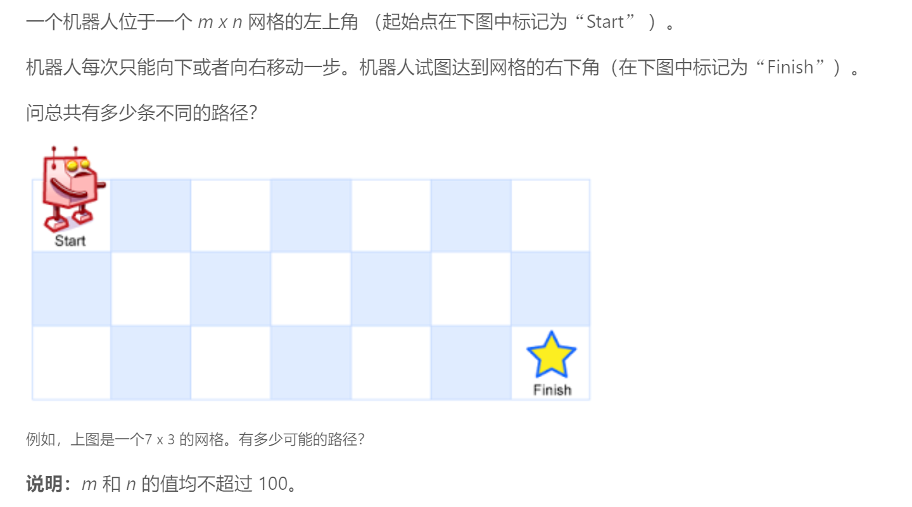
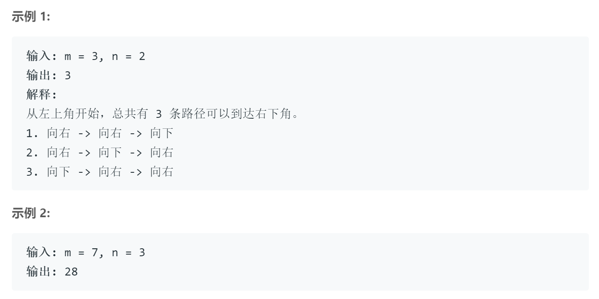

## 題目描述



<br/>

## 我的解法
```
class Solution {
public:
    int uniquePaths(int m, int n) {
        vector<vector<int>> path(n, vector<int>(m,0));
        for(int i=0; i<m; i++)
            path[0][i] = 1;
        for(int i=0; i<n; i++)
            path[i][0] = 1;
        for(int i=1; i<m; i++)
            for(int j=1; j<n; j++)
                path[j][i] = path[j-1][i] + path[j][i-1];
        
        return path[n-1][m-1];
    
    }
};
```

<br/>

## 要点
- 一开始思路是按照排列组合来的，但是因为m、n的范围是小于100，所以先相乘再除以阶乘会使得int超出范围，而如果先除以阶乘再做乘法，则会因为小数造成最后的结果有偏差
- 另一种思路就是动态规划，或者说是深度优先，每个块的路径数都等于它上方和左方两个，所以只要处理好边界（最上行和最左列）的值为一，其他的用动态规划即可解决