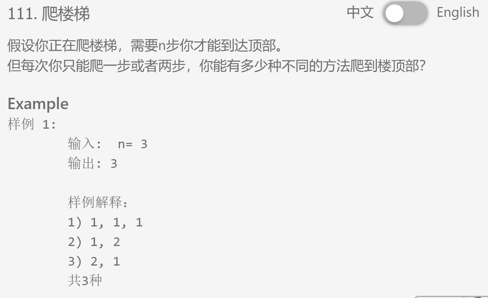

## 题目描述


## 我的解法
```
class Solution {
public:
    /**
     * @param n: An integer
     * @return: An integer
     */

    int climbStairs(int n) {
        // write your code here
        if (n == 1 || n==2 || n==0)
            return n;
        int lastlast = 1;
        int last = 2;
        int new_ = 0;
        for (int i=3; i<=n; i++)
        {
            new_ = last + lastlast;
            lastlast = last;
            last = new_;
        }
        return new_;
    }
};
```

## 要点
- 动态规划
- 如果只是简单的递归则系统会说超时，仔细一想，其实climbstairs(n) = climbstairs(n-1) + climbstaris(n-2)这样的话就没有保存之前算的结果，导致每一个的值最后都会被算三遍！！！所以稍作修改就变成了现在这样的代码
- new是关键字，不可用来命名变量！！