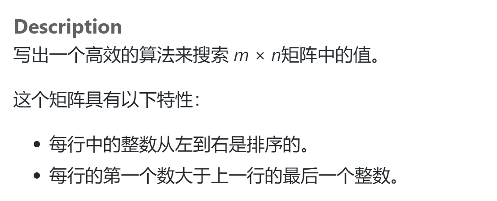
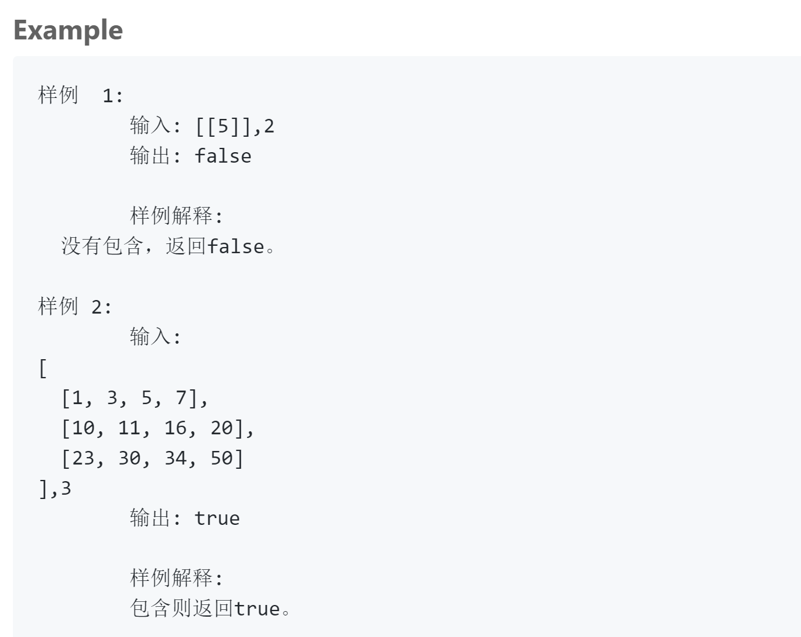

## 题目描述




## 我的解法
```
class Solution {
public:
    /**
     * @param matrix: matrix, a list of lists of integers
     * @param target: An integer
     * @return: a boolean, indicate whether matrix contains target
     */

    int searchLine(vector<vector<int>> &matrix, int target, int low, int high)
    {
        if(low == high)
            return low;
            
        int colSize = matrix[0].size();    
        if (low == (high-1))
        {
            if(target <= matrix[low][colSize-1])
                return low;
            else 
                return high;
        }
        
        int middle = low + (high - low)/2;
        if(target <= matrix[middle][colSize-1])
            return searchLine(matrix, target, low, middle);
        else
            return searchLine(matrix, target, middle, high);
    }
    
    bool searchCol(vector<int> &col, int target, int low, int high)
    {
        int middle = low + (high - low)/2;
        if(low >= (high -1))
        {
            if(col[low] == target || col[high] == target)
                return true;
            else
                return false;
        }
        if(target < col[middle])
            return searchCol(col, target, low, middle);
        else
            return searchCol(col, target, middle, high);
    }
     
    bool searchMatrix(vector<vector<int>> &matrix, int target) {
        // write your code here       
        int linecount = matrix.size();
        if (linecount == 0)
            return false;
        vector<int> row = matrix[searchLine(matrix, target, 0, linecount-1)];
        return searchCol(row, target, 0, row.size()-1);
    }
};
```

## 要点
- 最容易想到的方法是遍历，但是这样的话时间复杂度在最坏的情况下将达到O(m*n)
- 看到网上的提示，分别对矩阵的行和列进行二分法查找就行了
- 二分法结束递归的条件非常非常非常重要！！！