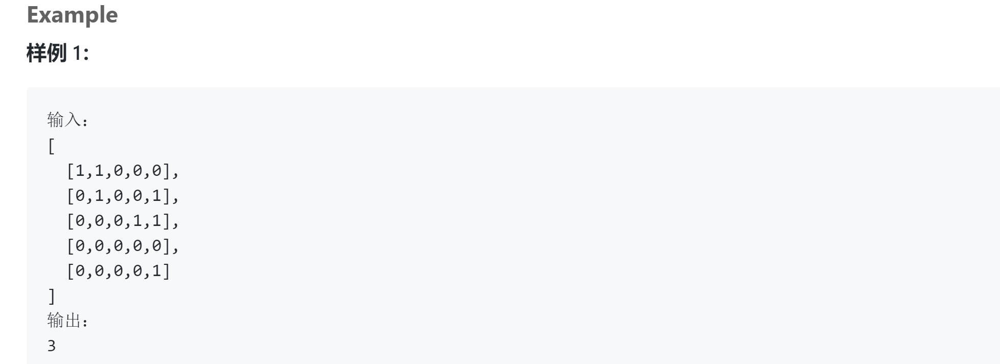
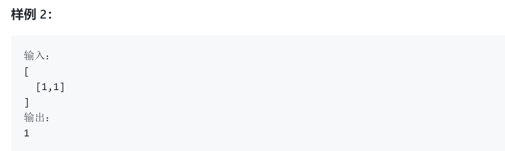

## 题目描述




##我的解法
```
class Solution {
public:
    /**
     * @param grid: a boolean 2D matrix
     * @return: an integer
     */

    int numIslands(vector<vector<bool>> &grid) {
        int rowCount = grid.size();
        if( rowCount == 0)
            return 0;
        int sum=0;
        int colCount = grid[0].size();
        for(int i=0; i<rowCount; i++)
            for(int j=0; j<colCount; j++)
            {
                if(grid[i][j] == false)
                    continue;
                else
                {
                    sum ++;
                    gridChange(grid, i, j, rowCount, colCount);
                }
                    
            }
        
        return sum;
    }

    
    void gridChange(vector<vector<bool>> &grid, int i, int j, int rowCount, int colCount)
    {
        grid[i][j] = 0;
        if(i>0 && grid[i-1][j]==true)
            gridChange(grid, i-1, j, rowCount, colCount);
        if(i<(rowCount-1) && grid[i+1][j]== true)
            gridChange(grid, i+1, j, rowCount, colCount);
        if(j>0 && grid[i][j-1]==true)
            gridChange(grid, i, j-1, rowCount, colCount);
        if(j<(colCount-1) && grid[i][j+1]==true)
            gridChange(grid, i, j+1, rowCount, colCount);
        return;
    }
};
```

## 要点
- DFS深度优先，依次遍历整个矩阵，如果有true的点，就将其本身标为false，然后判断它邻近的点，如果为true也标为false，同样，对于邻近的点，还要判断其邻近的点，和邻近点的邻近点......这样就是DFS的思想，所以可以想到用一个函数进行递归
- 这样一来，从一个点出发的递归就等于把这座岛都找到了并且全部置零，对下一个岛没有影响

## 我的解法2
```
class Solution {
public:
    /**
     * @param grid: a boolean 2D matrix
     * @return: an integer
     */
    int numIslands(vector<vector<bool>> &grid) {
        
        int rowCount = grid.size();
        if( rowCount == 0)
            return 0;
        int sum=0;
        int colCount = grid[0].size();
        for(int i=0; i<rowCount; i++)
            for(int j=0; j<colCount; j++)
            {
                if(grid[i][j] == false)
                    continue;
                else
                {
                    sum ++;
                    BFS(grid, i, j, rowCount, colCount);
                }
                    
            }
        
        return sum;
    }
    
    void BFS(vector<vector<bool>> &grid, int i, int j, int rowCount, int colCount)
    {
        queue<pair<int, int>> q;
        q.push(pair<int,int>(i,j));
        
        while(!q.empty())
        {
            pair<int, int> node = q.front();
            int row = node.first;
            int col = node.second;
            grid[row][col] = 0;
            q.pop();
            if(row>0 && grid[row-1][col]==true)
                q.push(pair<int,int>(row-1, col));
            if(row<(rowCount-1) && grid[row+1][col]== true)
                q.push(pair<int,int>(row+1, col));
            if(col>0 && grid[row][col-1]==true)
                q.push(pair<int,int>(row, col-1));
            if(col<(colCount-1) && grid[row][col+1]==true)
                q.push(pair<int,int>(row, col+1));
            
        }
        return;
    }
};
```

## 要点
- BFS广度优先，用一个队列来维护，吧某个点邻近点为true的点依次加入队列，然后每次判断队列的第一个
- 注意pair的用法