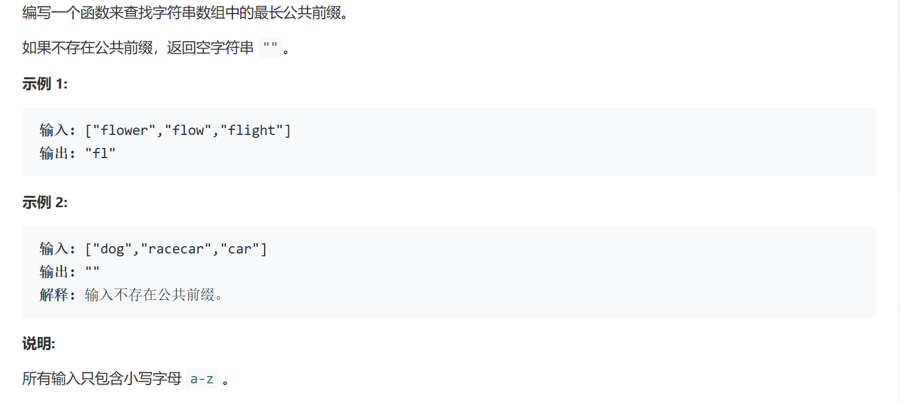

### 题目描述


###我的解法
```
class Solution {
    public String longestCommonPrefix(String[] strs) {
        if (strs.length == 0) {
            return "";
        }
        if (strs.length == 1) {
            return strs[0];
        }
        int size = strs.length;
        String result = getCommonPrefix(strs[0], strs[1]);
        for (int i=2; i<size; i++) {
            result = getCommonPrefix(result, strs[i]);
            if (result == "") {
                return result;
            }
        }
        return result;
    }
    
    private String getCommonPrefix(String word1, String word2) {
        int len = word1.length() < word2.length() ? word1.length() : word2.length();  
        String result = "";
        for (int i=0; i<len; i++) {
            if (word1.charAt(i) == word2.charAt(i)) {
                result += word1.charAt(i);
            } else {
                return result;
            }
        }
        return result;
    }
}
```

### 要点
- 先将前两个word比较得出一个公共前缀，然后每次将这个公共前缀和后一个word进行比较并更新公共前缀，最后返回若中途为空字符串则直接返回
- array.length
- array[0]
- char的比较相等要用==不能用equals