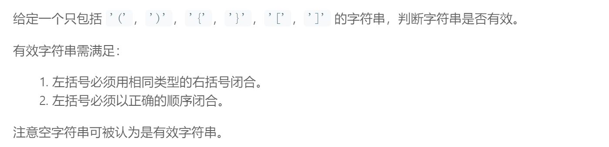
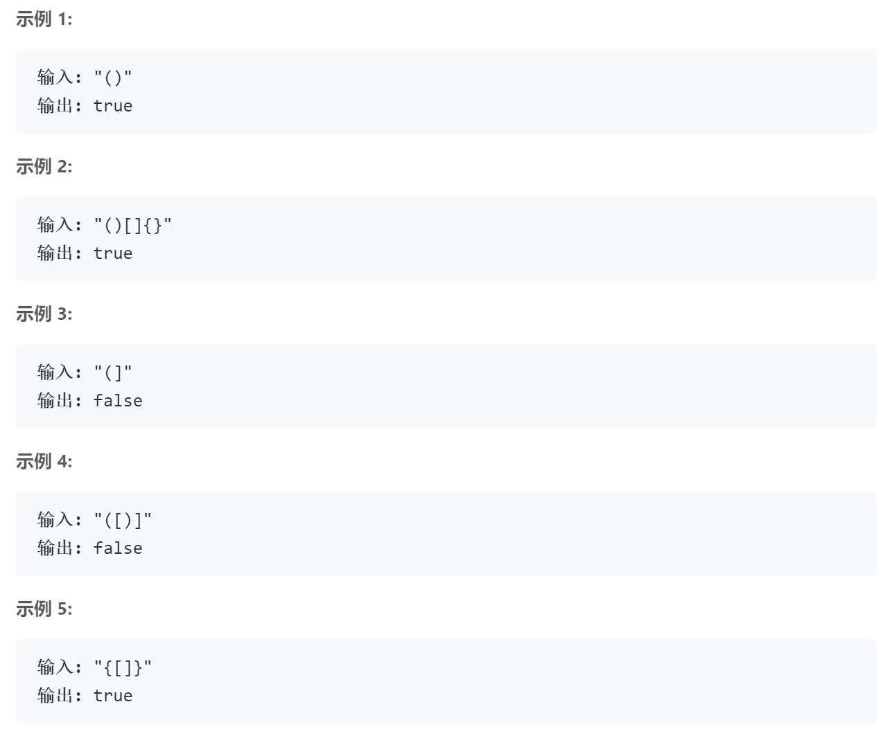

## 题目描述



<br />

## 我的解法
```
class Solution {
    public boolean isValid(String s) {
        Stack<Character> front = new Stack<>();
        Map<Character, Character> map = new HashMap<>();
        int len = s.length();
        for (int i=0; i<len; i++) {
            char tmp = s.charAt(i);
            switch (tmp) {
                case '{':
                case '(':
                case '[':
                    front.push(tmp);
                    break;
                case ')':
                    if (front.size() == 0 || front.pop() != '(') {
                        return false;
                    }
                    break;
                case '}':
                    if (front.size() == 0 || front.pop() != '{') {
                        return false;
                    }
                    break;
                case ']':
                    if (front.size() == 0 || front.pop() != '[') {
                        return false;
                    }
                    break;
                default:
                    return false;
            }
        }
        if (front.size() > 0) {
            return false;
        }
        return true;
    }
}
```

# 要点
- java有数据结构Stack
