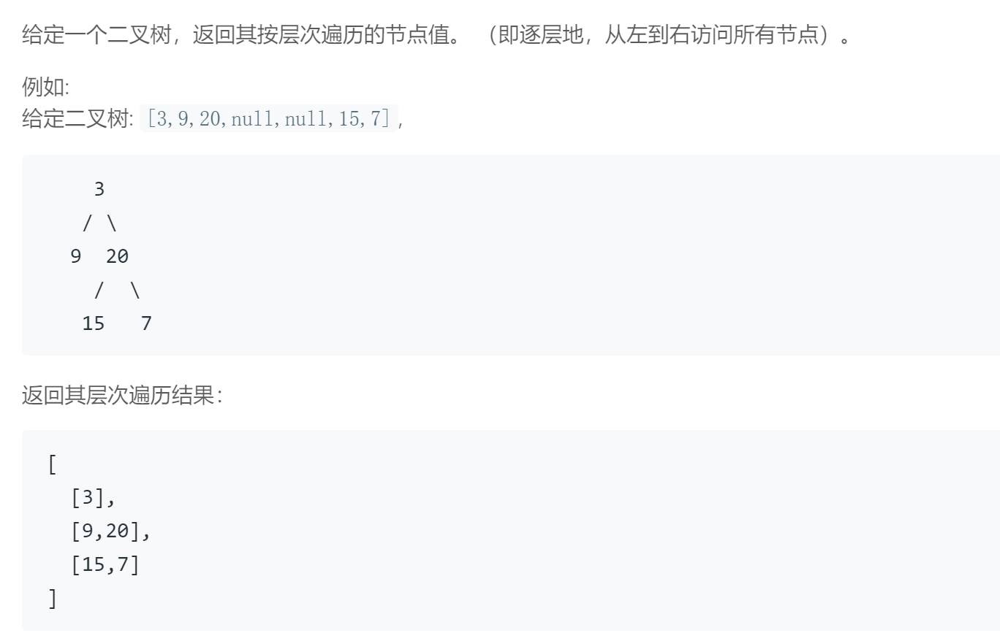

## 题目描述

<br/>

## 我的解法
```
/**
 * Definition for a binary tree node.
 * struct TreeNode {
 *     int val;
 *     TreeNode *left;
 *     TreeNode *right;
 *     TreeNode(int x) : val(x), left(NULL), right(NULL) {}
 * };
 */

class Solution {
public:
    vector<vector<int>> levelOrder(TreeNode* root) {
        vector<vector<int>> result;
        queue<TreeNode*> q;
        if(root == NULL)
            return result;
        q.push(root);
        while(!q.empty())
        {
            int level = q.size();
            vector<int> sub_result;
            for(int i=0; i<level; i++)
            {
                TreeNode* front = q.front();
                q.pop();
                sub_result.push_back(front->val);
                if(front->left != NULL)
                    q.push(front->left);
                if(front->right != NULL)
                    q.push(front->right);
            }
            result.push_back(sub_result);
            
        }
        return result;
    }
};
```
<br/>

## 要点
- 每一层节点的读取是按照父层的顺序依次读取左右儿子的，所以对于父层而言，可想到用一个存放node的queue来维护
- 不需要每层一个queue，因为可以将新的节点加入queue的尾部，每次将front节点的左、右儿子存入队列（如果非空），只需知道节点个数即可
- 每一层有几个节点取决于上一层节点的儿子个数，所以在上一层全部出队的时候，队列里剩下的全是下一层的节点，即可判断该层节点个数
- 注意root为空的情况
