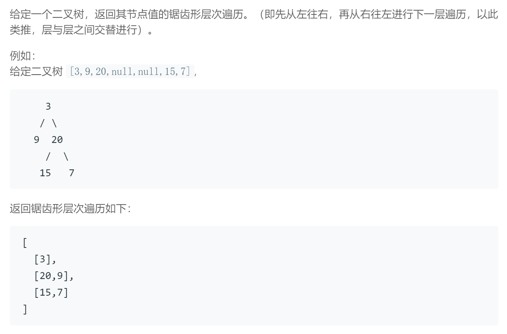

## 题目描述


<br/>

## 我的解法
```
/**
 * Definition for a binary tree node.
 * struct TreeNode {
 *     int val;
 *     TreeNode *left;
 *     TreeNode *right;
 *     TreeNode(int x) : val(x), left(NULL), right(NULL) {}
 * };
 */
class Solution {
public:
    void judgeNode(TreeNode* node, stack<TreeNode*> &children,vector<int> &sub_result )
    {
        if(node != NULL)
        {
            sub_result.push_back(node->val);
            children.push(node);
        }  
    }
    
    vector<vector<int>> zigzagLevelOrder(TreeNode* root) {
        vector<vector<int>> result;
        
        if(root == NULL)
            return result;

        stack<TreeNode*> parent;
        stack<TreeNode*> children;
        bool flag = true;
        
        children.push(root);
        vector<int> root_res;
        root_res.push_back(root->val);
        result.push_back(root_res);
        
        while(!children.empty())
        {
            parent = children;
            while(!children.empty())
                children.pop();

            vector<int> sub_result;
            int level = parent.size();
            for(int i=0; i<level; i++)
            {
                TreeNode* front = parent.top();
                parent.pop();
                if(!flag)
                {
                    judgeNode(front->left, children, sub_result);                      
                    judgeNode(front->right, children, sub_result);
                }
                else
                {
                    judgeNode(front->right, children, sub_result);                      
                    judgeNode(front->left, children, sub_result);                   
                }                
            }            

            if(!sub_result.empty())
                result.push_back(sub_result);
            flag = !flag;
        }
        return result;
    }
};
```

<br/>

## 要点
- 整体思路同第102题
- 因为是锯齿形遍历，所以每一层放入容器的顺序和遍历读取的顺序刚好相反，所以此题使用stack代替queue
- 层与层之间读取方向刚好相反，所以用变量flag来进行判断
- stack是后进先出，所以为了保证同层其他节点的子节点一定在该层所有节点全部放入stack后才放入，用两个stack来维护，每次循环要将上次循环的children stack赋给此次循环的parent stack，然后清空children stack
- 因为sub_result是在for循环前就初始化的，所以在添加进result前需要判断是否为空