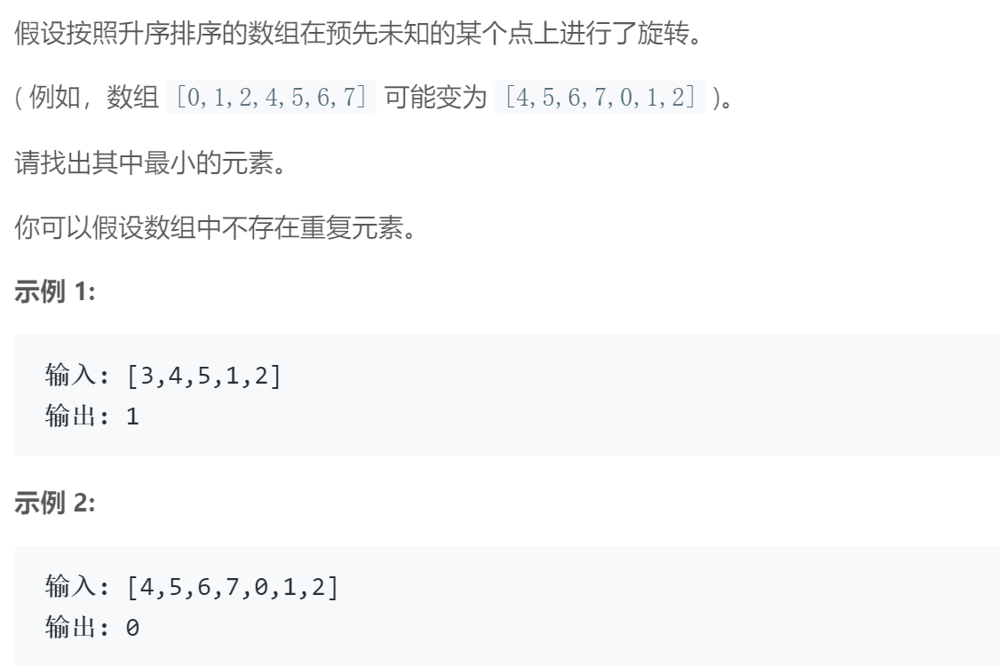

## 题目描述


<br/>

## 我的解法
```
## 解法一

class Solution {
public:
    int findMin(vector<int>& nums) {
        int size = nums.size();
        int right = nums[0];
        for (int i=0; i<size-1; i++)
        {
            int left = right;
            right = nums[i+1];
            if(right < left)
                return right;          
        }
        return nums[0];
    }
};


## 解法二
class Solution {
public:
    int division(vector<int>& nums, int left, int right)
    {
        if(left == right-1)
        {
            if(nums[left] <= nums[right])
                return nums[left];
            return nums[right];
        } 
        int size = nums.size();
        int mid = (left+right)/2;
        if( nums[mid]> nums[right] )
            return division(nums, mid, right);
        else
            return division(nums, left, mid);
    }
    
    
    int findMin(vector<int>& nums) {
        if(nums.size() == 1)
            return nums[0];
        return division(nums, 0, nums.size()-1);
        
    }
};

```

<br/>

## 要点

- 解法一是最容易想到的，关键点是旋转之后一开始是递增的，然后在某一点突然变小，所以只要找到那个转变点即可
- 解法二用的是二分查找，思想是每次缩小一半的范围
- vector.erase(beg,end) 删除[beg,end)区间的数据 但是beg和end是指针，太复杂，所以采用记录头尾id来代替切割
- 这里采用的终止条件是范围内只剩下两个数，即可直接得到答案
- 注意临界条件，如nums只有一个数的情形