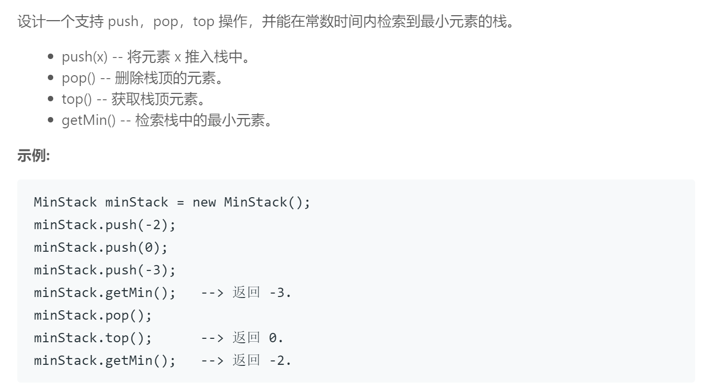

## 题目描述


<br/>

## 我的解法
```
class MinStack {
public:
    /** initialize your data structure here. */
    MinStack() 
    {}
    
    void push(int x) 
    {
        normal_s.push(x);
        if(min_s.empty() || x<=min_s.top())
            min_s.push(x);
    }
    
    void pop() 
    {
        if(normal_s.top() == min_s.top())
            min_s.pop();
        normal_s.pop();
        
    }
    
    int top() 
    {
        return normal_s.top();
    }
    
    int getMin() 
    {
        return min_s.top();
    }
    
private:
    stack<int> normal_s, min_s; 

};
```

<br/>

## 要点
- 比原来的stack多增加了一个最小值的功能，所以需要记录最小值，但是不能仅仅用一个变量记录，因为假设最小值被pop掉了的话，还要找下一个最小的，所以用一个stack来存储
- 每次push一个数的时候要判断是否比目前的最小值更小，pop的时候判断是否是最小值，如果是的话两个stack都需要pop