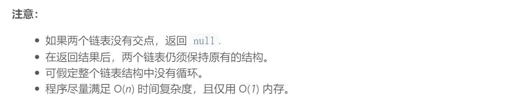

## 题目描述



<br/>

## 我的解法
```
/**
 * Definition for singly-linked list.
 * struct ListNode {
 *     int val;
 *     ListNode *next;
 *     ListNode(int x) : val(x), next(NULL) {}
 * };
 */
class Solution {
public:
    ListNode *getIntersectionNode(ListNode *headA, ListNode *headB) {
        if(headA == NULL || headB == NULL)
            return NULL;
        
        stack<ListNode*> s1, s2;
        ListNode* tmp = headA;
        while(tmp != NULL)
        {
            s1.push(tmp);
            tmp = tmp->next;
        }
        tmp = headB;
        while(tmp != NULL)
        {
            s2.push(tmp);
            tmp = tmp->next;
        }
        
        ListNode* both = new ListNode(0);
        bool flag = false;
        while(!s1.empty() && !s2.empty())
        {
            if(s1.top() == s2.top())
            {
                both = s1.top();
                flag = true;
            }
            else 
                break;
            
            s1.pop();
            s2.pop();
        }
        if(flag == false)
            return NULL;
        else
            return both;      
    }
};
```

<br/>

## 要点
- 我的思路是：如果有相交，那么他们的尾部一定一样，所以想到从后往前比，直到比较到不一样的节点，用stack来存储节点
- 一开始需要进行是否为空的判断