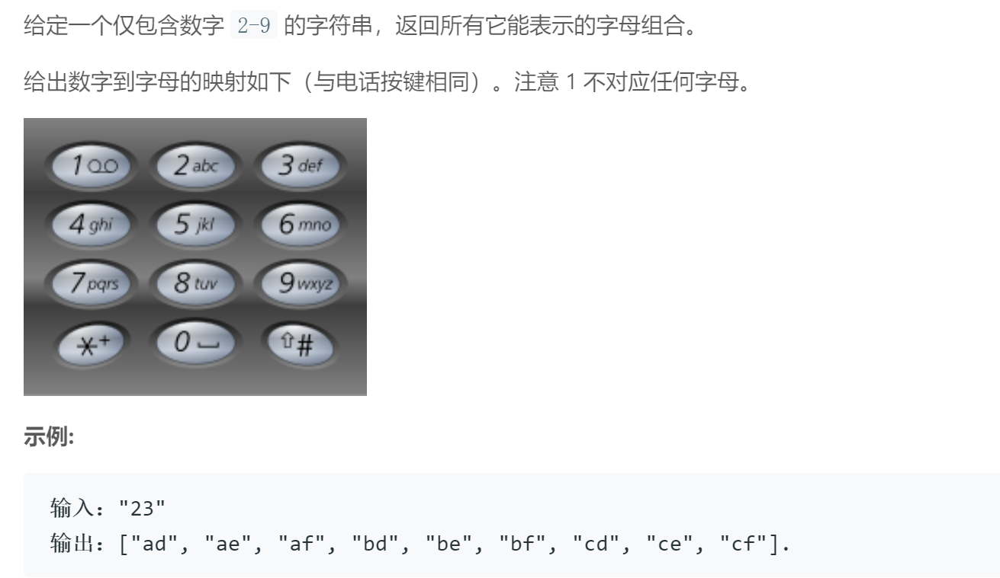

## 题目描述


<br />

## 我的解法
```
class Solution {
public:
    vector<string> letterCombinations(string digits) {
        map<char, string> m;
        m['2'] = "abc";
        m['3'] = "def";
        m['4'] = "ghi";
        m['5'] = "jkl";
        m['6'] = "mno";
        m['7'] = "pqrs";
        m['8'] = "tuv";
        m['9'] = "wxyz";
        
        int size = digits.size();
        vector<string> result;        
        for(char val : m[digits[0]])
        {
            string s;
            s = s + val;
            result.push_back(s);
        }
        
        int count = 1;
        while (count < size)
        {
            vector<string> tmp;
            tmp = result;
            result.clear();
            int len = tmp.size();
            for (int i=0; i<len; i++)
            {
                int append_len = m[digits[count]].length();
                for(int j=0; j<append_len; j++)                
                    result.push_back(tmp[i] + m[digits[count]][j]);                         
            }   
            count ++;           
        }
        return result;
    }
};
```

<br />

## 要点
- 用map来存数字和字符串的键值对
- 遍历的时候注意边界值
- 用两个vector，其中一个存上一轮遍历的结果，另一个用来存新的string
- vector求长度用size(), string求长度用length()
- string后面加上一个字符只能用s=s+c形式不能用s+=c