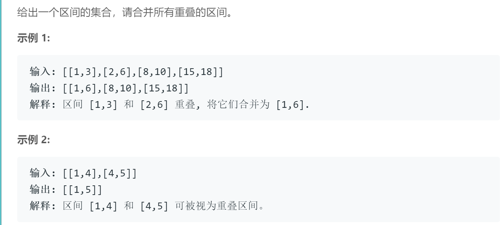

## 题目描述


<br/>

## 我的解法
```
/**
 * Definition for an interval.
 * struct Interval {
 *     int start;
 *     int end;
 *     Interval() : start(0), end(0) {}
 *     Interval(int s, int e) : start(s), end(e) {}
 * };
 */
class Solution {
public:

    static bool cmp(const Interval &a, const Interval &b) {
        return a.start < b.start;
    }
    
    vector<Interval> merge(vector<Interval>& intervals) {
        int size = intervals.size();
        vector<Interval> result;
        if(size <= 1)
            return intervals;
        sort(intervals.begin(), intervals.end(), cmp);
        result.push_back(intervals[0]);
        for(int i=1; i<size; i++){
            if(intervals[i].start > result.back().end)
                result.push_back(intervals[i]);         
            else 
                result.back().end = max(result.back().end, intervals[i].end);
        }
        return result;
    }
};
```

<br/>

## 思路
- 一开始想的太复杂，在思考如何将无序的列表进行合并，但其实如果将intervals的start按升序排序，则难度大大降低
- 本题难度之一就是如何排序，因为它不是单纯的数字，而是一个struct。
  一般对于struct的排序会多加一个参数cmp，如上述代码，即定义一个函数来指定如何对struct进行排序
  或者也可以写成：
  ```
  sort(intervals.begin(), intervals.end(), [](Interval &a, Interval &b) {return a.start < b.start;});
  ```
- 注意边界值，当intervals为空或者只有一个区间的时候，直接返回其本身即可