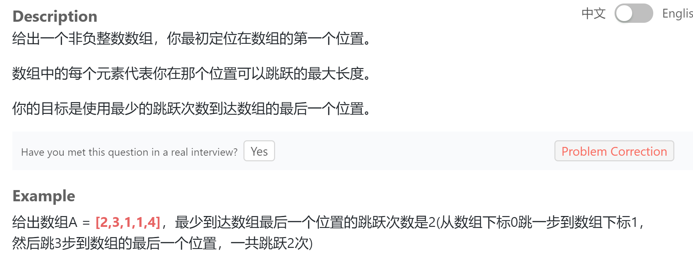

## 题目描述


## 我的解法
```
class Solution {
public:
    /**
     * @param A: A list of integers
     * @return: An integer
     */

    int jump(vector<int> &A) {
        int size = A.size();
        if(size == 1)
            return 0;
        vector<int> distance(size);
        distance[0] = A[0];
        int count = 1;
        if(distance[0] >= size)
            return count;
        for (int i=1; i<size; i++)
        {
            int tmp = i+A[i];
            if(tmp <= distance[i-1])
                distance[i] = distance[i-1];
            else
            {
                distance[i] = tmp;
                count += 1;
            }
            if(distance[i] >= (size-1))
                break;
        }
        return count;
    }
};
```

##要点
- 用另一个列表来存每个点能跳到最远的位置
- 每个节点能跳到的最远距离要么是前一个的距离，要么是自己的位置加上能跳的距离，如果是后者的话那么总步数要加一
-判断循环结束的条件就是某个点能跳的最远的距离超过了末尾
- 注意边界值：如果总共就只有一个元素/第一个元素的值就能跳到末尾，所以在进入循环前就要进行判断

