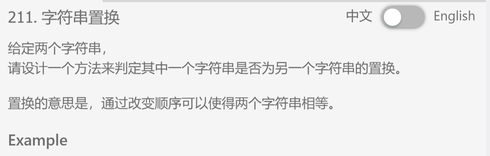

## 题目描述


## 我的解法
```
class Solution {
public:
    /**
     * @param A: a string
     * @param B: a string
     * @return: a boolean
     */
    bool Permutation(string &A, string &B) {
        int size1 = A.size();
        int size2 = B.size();
        if(size1 ==0 && size2==0)
            return true;
        map<char, int> m1;
        map<char, int> m2;
        map<char, int>::iterator it;
        for (int i=0; i<size1; i++){
            if(m1.find(A[i]) != m1.end())
                m1[A[i]]++;
            else
                m1[A[i]] = 1;
        }
        for (int i=0; i<size2; i++){
            if(m2.find(B[i]) != m2.end())
                m2[B[i]]++;
            else
                m2[B[i]] = 1;
        }
        if(m1.size() != m2.size())
            return false;
        for(it=m1.begin(); it!=m1.end(); it++)
        {
            char c = it->first;
            if(m2[c] == m1[c])
                continue;
            else
                return false;
        }
        return true;
    }
};
```

## 要点
- 能置换的条件无非就是两个字符串含有的字母种类都一样，并且每个字母的个数都相同， 所以就想到了用map
- 迭代器的值通过it->first 和 it->second