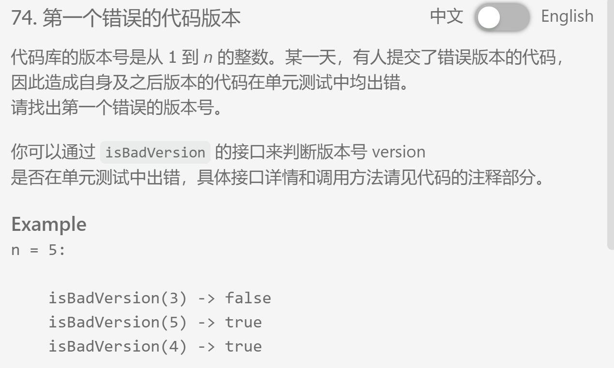

##题目描述


## 我的代码
```
/**
 * class SVNRepo {
 *     public:
 *     static bool isBadVersion(int k);
 * }
 * you can use SVNRepo::isBadVersion(k) to judge whether 
 * the kth code version is bad or not.
*/

class Solution {
public:
    /**
     * @param n: An integer
     * @return: An integer which is the first bad version.
     */
    SVNRepo repo;
    int search(int low, int high){
        if(high <= (low + 1))
        {
            if(repo.isBadVersion(low))
                return low;
            else
                return high;
        }
        int middle = (high-low)/2 + low;
        if(repo.isBadVersion(middle))
            return search(low, middle);
        else
            return search(middle, high);
    }

    int findFirstBadVersion(int n) {
        // write your code here
        search(1, n);
    }
};
```

## 要点
- 很明显用二分法查找，因为是根据某一特性将有序的数列分成两部分，具有临界点
- 需要调用别的类的方法，所以不要忘记创建一个实例repo
- 当left和right数值都较大的时候可能溢出，所以用low+(high-low)/2的方法来代替加一加除以二